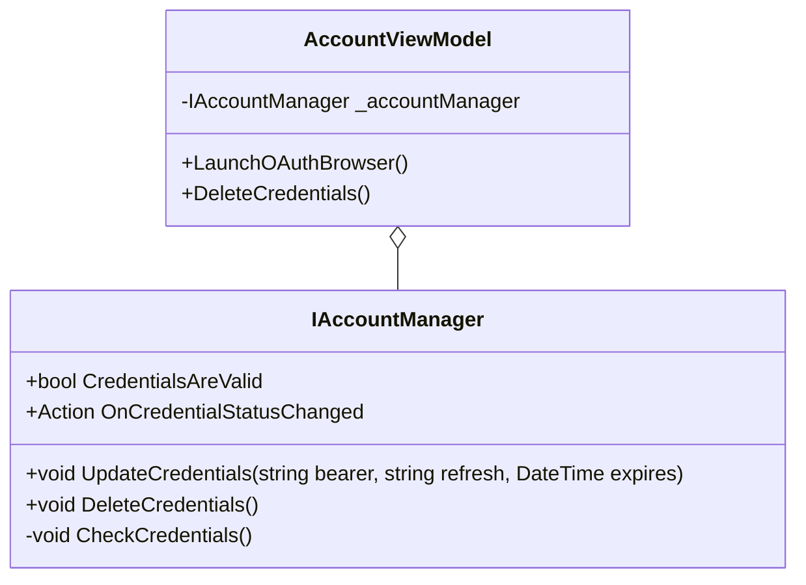

# twitch-streaming-tools

Tools to aid twitch streamers.

## Design

### Account Management

Relationship between the view model and the account manager used to keep Twitch OAuth credentails up-to-date

